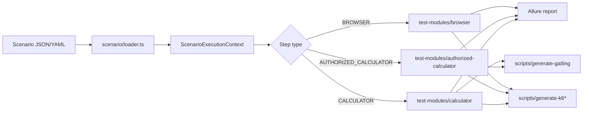

# FuncAndPerf — API Test Automation & Performance Testing Framework

FuncAndPerf is a scenario-driven framework for API functional testing (Playwright)
and performance testing (k6, Gatling). A single declarative scenario file drives
functional execution, Allure reporting, and generation of k6/Gatling/Cucumber
artefacts.

This page is the landing for the generated TypeDoc reference. Use the
navigation on the left to browse modules, classes, interfaces and functions.

## Architecture at a glance



## Key modules

| Concern | Entry point |
|---------|-------------|
| Configuration | `config` / `AppConfig` |
| Scenario loading | `Scenario`, `loadScenarios` |
| k6 generator contract | `K6StepGenerator` |
| Gatling generator contract | `GatlingStepGenerator` |
| Validations | `validateApiResponse` |
| Reporting helpers | `allure/helpers` |
| CLI shared utilities | `scripts/shared` |

Open the **Modules** page (left navigation) to browse every documented export,
or use the search box in the top-left corner to jump directly to a symbol.

## Quick start

1. Author a scenario file in `tests/scenarios/` (JSON or YAML).
2. Run functional tests against the mock server:
   ```bash
   npm run mock:start
   npm run test:calc
   ```
3. Generate performance scripts:
   ```bash
   npm run k6:generate
   npm run gatling:generate
   ```
4. Generate human-readable Cucumber features:
   ```bash
   npm run cucumber:generate
   ```

## Building this documentation

```bash
npm run docs        # build HTML into docs/
npm run docs:serve  # serve locally on http://localhost:8080
npm run docs:check  # CI gate: validate symbols without emitting files
```

The generated `docs/` directory is git-ignored; this `docs-index.md` file is
tracked and used by TypeDoc as the project landing page.

> A hosted copy of this reference is published automatically to **GitHub Pages**
> on every push to `main`. See the *Published reference (GitHub Pages)* section
> of `README.md` for the URL and one-time setup steps.
